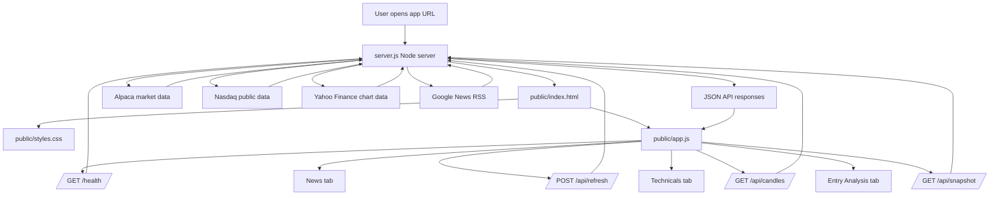

# Mag 7 Stock Desk

Mag 7 Stock Desk is a local web dashboard for monitoring the Magnificent 7 stocks:

- Apple (`AAPL`)
- Microsoft (`MSFT`)
- Alphabet (`GOOGL`)
- Amazon (`AMZN`)
- NVIDIA (`NVDA`)
- Meta (`META`)
- Tesla (`TSLA`)

The app combines market data, technical indicators, candlestick pattern checks, analyst target context, and scoped news headlines. It is designed as a decision-support dashboard, not as automated financial advice.

## What's New

- **Rebalanced Setup Quality scoring.** The score is now a weighted average of six factors that each score `-1` to `+1`, replacing the old fixed point adjustments. Correlated moving-average checks are combined into one trend factor, RSI is graded on a smooth curve instead of hard thresholds, volume only counts when it confirms the day's direction, sentiment is averaged per item so coverage volume cannot inflate it, and analyst upside is measured against the typical consensus premium. Factors with missing data are excluded and the rest reweighted instead of being scored as neutral. See [Interpreting Entry Analysis](#interpreting-entry-analysis).
- **Complete market statistics, including bid/ask.** The Technicals panel now reliably fills bid, ask, average volume, market cap, 52-week range, P/E, EPS, and dividend yield through a multi-source enrichment layer (Nasdaq, Yahoo, and Alpaca's latest-quote endpoint). Values are cached per symbol so the panel never regresses to `--`. Outside market hours, bid/ask show a note that they will appear during the next trading day if no quote source is available.
- **Simplified UX.** The layout has been reorganized around three tabs — Entry Analysis, Technicals, and News — with redundant market-wide panels removed.
- **Deployment support.** The repo now includes `package.json`, `render.yaml`, and a `Dockerfile` for running the app on Render, in Docker, or on any Node host. See [Deployment](#deployment).

## Main Views

### Entry Analysis

Entry Analysis is the first tab and is intended to summarize whether the selected stock has a constructive setup.

It includes:

- A synced stock selector for the Mag 7 symbols.
- A `Setup Quality` score from `0` to `100`.
- Bias: bullish, neutral, bearish, or unavailable.
- Setup type, such as pullback, continuation, confirmation needed, or wait for repair.
- Entry zone.
- Invalidation level.
- Target price.
- Estimated risk/reward.
- Sentiment summary from news and analyst review text.
- A short explanation list showing the signals that affected the score.

The scoring is rule-based and uses six weighted factors:

- Trend composite: price versus SMA 20, price versus SMA 50, and SMA 20 versus SMA 50 structure, graded by distance and averaged into a single factor.
- RSI 14 momentum quality.
- Direction-aware volume confirmation.
- 4-hour candlestick pattern confirmation.
- News and analyst sentiment.
- Analyst target upside measured against the typical consensus premium.

Each factor scores between `-1` and `+1` and carries a weight. Factors with missing data (for example, candles still loading or too few headlines) are excluded and the remaining weights are renormalized, so absent data neither fakes neutrality nor drags the score toward `50`. See [Interpreting Entry Analysis](#interpreting-entry-analysis) for the full rules.

### Technicals

Technicals contains the charting and indicator workspace for the selected stock.

It includes:

- Live price strip.
- Candlestick chart.
- Historical price chart.
- Candle interval controls: `5m`, `15m`, `30m`, and `4h`.
- Candle period controls: `1D`, `1W`, `3M`, `6M`, `1Y`, and `All`.
- Chart zoom and pan controls.
- Company profile fields (CEO, founded, employees, headquarters).
- Market statistics: bid, ask, volume, average volume, open, today's high/low, market cap, 52-week high/low, P/E ratio, EPS, dividend yield, and previous close.
  - Bid and ask come from live quote data. Outside market hours they may be unavailable from some providers; when no quote is available, the panel shows a note that the value will appear during the next trading day.
- Technical indicators:
  - SMA 20
  - SMA 50
  - RSI 14
  - Volume ratio
  - Bullish/neutral/bearish signal
- Candlestick pattern analysis across multiple periods and intervals.

### News

News is scoped to the selected stock so it is clear which symbol is being reviewed.

It includes:

- Synced stock selector.
- Scope heading such as `Looking for GOOGL news and analyst reviews`.
- Analyst review cards.
- Analyst consensus target, low target, and high target where available.
- Firm/source review notes from analyst-related headlines.
- Google News headline feed for the selected stock.

## How The App Fits Together

The app has one Node backend and one static browser frontend.

High-level flow:

```text
server.js
  serves public/index.html, public/styles.css, public/app.js
  exposes /api/snapshot, /api/candles, /api/refresh, /health

browser
  loads index.html
  loads styles.css
  loads app.js
  app.js calls backend APIs
  app.js renders Entry Analysis, Technicals, and News
```

### Architecture Diagram



### File Responsibilities

| File | Role |
| --- | --- |
| `server.js` | Backend data engine and HTTP server. Fetches market data, candles, news, and analyst context. Serves the frontend and exposes API routes. |
| `public/index.html` | Page skeleton. Defines the tab structure, panels, placeholders, chart canvases, and script/style references. |
| `public/app.js` | Frontend logic. Fetches API data, manages state, switches tabs, syncs stock selectors, calculates Entry Analysis, renders news/reviews, and draws charts. |
| `public/styles.css` | Visual layer. Controls layout, cards, tabs, responsive behavior, Entry Analysis styling, chart panels, News cards, and the scoring rules drawer. |
| `README.md` | Project documentation. Explains usage, setup, deployment, APIs, scoring rules, and troubleshooting. It is not loaded by the running app. |
| `package.json` | Node project metadata and scripts. `npm start` depends on this file because it runs `node server.js`. |
| `render.yaml` | Render deployment configuration. Defines build/start commands, health check path, and default environment variables. |
| `Dockerfile` | Optional container deployment definition. Builds a Node image and starts the app with `npm start`. |
| `.dockerignore` | Optional Docker helper. Excludes unnecessary files from Docker image builds. |

### Runtime Request Flow

1. A user opens the app URL.
2. `server.js` serves `public/index.html`.
3. The browser loads `public/styles.css` and `public/app.js`.
4. `public/app.js` calls:

```text
GET /api/snapshot
```

5. `server.js` returns stock rows, news items, analyst reviews, timestamps, and error metadata.
6. `public/app.js` renders:

- Entry Analysis
- Technicals
- News

7. When the user changes candle period or interval, `public/app.js` calls:

```text
GET /api/candles?symbol=GOOGL&period=week&interval=4h
```

8. `server.js` returns detailed candle data.
9. `public/app.js` redraws the candlestick chart and updates pattern analysis.

### Deployment File Requirements

For a normal Node deployment, these files are required:

```text
server.js
package.json
public/index.html
public/app.js
public/styles.css
```

For Render deployment, include:

```text
render.yaml
```

For Docker deployment, include:

```text
Dockerfile
.dockerignore
```

If `package.json` is missing, most hosts will not know how to run `npm start`. If `public/app.js` or `public/styles.css` is missing or stale, the server may start but the browser UI can look broken or behave like an older version.

## Data Sources

The app uses several data sources with fallback behavior:

- Alpaca market data, when `ALPACA_API_KEY` and `ALPACA_API_SECRET` are configured.
- Nasdaq public endpoints for market snapshot, historical data, and analyst target information.
- Yahoo Finance chart endpoints as a fallback for quote/history/candle data.
- Google News RSS for headlines and analyst-related news.

For market snapshots, the app prefers Alpaca when credentials are available. If Alpaca is not configured or temporarily unavailable, it tries Nasdaq and Yahoo public endpoints. If public providers rate-limit the request, the app preserves the last good snapshot where possible and can use cached candle data as a fallback instead of showing blank rows.

### Fundamentals Enrichment

Alpaca and Yahoo snapshot rows do not carry fundamentals (bid/ask, average volume, market cap, 52-week range, P/E, EPS, dividend yield), and a rate-limited cycle can blank them entirely. A separate enrichment layer fills these gaps on every snapshot:

1. Nasdaq summary/info endpoints are tried first. Because Nasdaq stopped exposing EPS and P/E on its quote summary, trailing-twelve-month EPS is derived from the last four reported quarters, and P/E is computed from that EPS and the current price.
2. Yahoo Finance chart data fills anything still missing, including the 52-week range derived from a year of daily history.
3. Alpaca's latest-quote endpoint is tried as a third source for bid/ask. It returns the last known quote of the session even after hours, whereas Nasdaq only has bid/ask while the market is open.

Fetched values are cached per symbol and refreshed every 10 minutes by default (`FUNDAMENTALS_REFRESH_MS`). The last good value is kept between refreshes, so the market statistics panel never regresses to `--` after it has shown real data once.

## Running Locally

Install dependencies:

```bash
npm install
```

Start the app:

```bash
npm start
```

Open:

```text
http://localhost:3000
```

If port `3000` is already in use, run on another port:

```bash
PORT=3001 npm start
```

## Optional Alpaca Configuration

Alpaca credentials are recommended because public finance endpoints can rate-limit.

Set these environment variables before starting the app:

```bash
export ALPACA_API_KEY="your_key"
export ALPACA_API_SECRET="your_secret"
npm start
```

Or run inline:

```bash
ALPACA_API_KEY="your_key" ALPACA_API_SECRET="your_secret" npm start
```

When configured, Alpaca is used first for market snapshots and detailed candle data. The `4h` candle interval maps to Alpaca `4Hour` bars.

## Refresh Behavior

Default refresh intervals:

- Market snapshot: every 60 seconds.
- News and analyst review data: every 10 minutes.
- Fundamentals enrichment (bid/ask, market cap, 52-week range, P/E, EPS): every 10 minutes.

Override intervals:

```bash
REFRESH_MS=15000 NEWS_REFRESH_MS=600000 npm start
```

Other environment variables:

```bash
PORT=3000
FETCH_TIMEOUT_MS=12000
FUNDAMENTALS_REFRESH_MS=600000
ALPACA_API_KEY=...
ALPACA_API_SECRET=...
```

## API Endpoints

### Health Check

```text
GET /health
```

Returns basic server status.

### Snapshot

```text
GET /api/snapshot
```

Returns:

- Loading state.
- Refresh timestamps.
- Errors, if any.
- Stock rows.
- News items.
- Analyst review items.
- Refresh interval metadata.

### Manual Refresh

```text
POST /api/refresh
```

Forces a fresh market snapshot and news refresh.

### Detailed Candles

```text
GET /api/candles?symbol=GOOGL&period=week&interval=4h
```

Supported periods:

- `day`
- `week`
- `threeMonth`
- `sixMonth`
- `oneYear`
- `all`

Supported intervals:

- `5m`
- `15m`
- `30m`
- `4h`

When Alpaca is configured, detailed candles use Alpaca first. Without Alpaca, Yahoo is used where possible. For `4h` Yahoo fallback, the app fetches `1h` candles and aggregates them into 4-hour candles.

## Interpreting Entry Analysis

Entry Analysis is a structured setup review. It is not a guarantee and should not be treated as a buy or sell instruction.

The `Setup Quality` score is a transparent rule-based score, not a z-score and not a machine-learning prediction. Each factor produces a value between `-1` and `+1` and carries a weight. The weighted average of the available factors maps to a `0-100` score centered on a neutral `50`:

```text
score = 50 + 50 * (sum(weight * value) / sum(weight))
```

Factors with missing data are excluded and the remaining weights are renormalized, so absent data neither fakes neutrality nor drags the score toward `50`. The explanation list under the score shows each factor's point contribution, plus a note for any factor that was excluded and why.

The weights are heuristic: they are chosen to make trend, momentum, 4-hour structure, sentiment, and target context visible without letting any single non-price input dominate the score. They should be treated as a baseline that can be tuned later with backtesting.

Current scoring factors:

| Factor | Weight | How it is scored | Reasoning |
| --- | --- | --- | --- |
| Trend composite | `20` | Three graded checks averaged into one value: price vs SMA 20 (full credit at ±3% distance), price vs SMA 50 (full credit at ±5%), and SMA 20 vs SMA 50 (full credit at ±2%). | The three moving-average relationships are strongly correlated, so they are combined into one factor instead of counted three times. Grading by distance means barely above a moving average scores near zero rather than getting full credit. |
| RSI 14 | `12` | Peaks at `+1` near RSI 55 and fades linearly toward both extremes (`value = 1 - |RSI - 55| / 20`), going negative beyond roughly 35 and 75. | Momentum is best for entries when constructive but not extended. The smooth curve penalizes overbought and oversold symmetrically with no threshold cliffs, so a small RSI change cannot flip the score. |
| Volume | `6` | Scores only when volume is at least 1.1x its recent average, and adds in the direction of the day's move: heavy volume on an up day confirms, heavy volume on a down day counts against the setup. Near-average volume contributes zero. | Volume is a confirmation signal, not a standalone one. The old model treated any above-average volume as positive, which rewarded heavy selling. |
| 4-hour candle pattern | `12` | Bullish pattern scores `+1`, bearish `-1`, neutral `0`. Requires at least 8 completed 4-hour candles; otherwise the factor is excluded and a note explains why. | The 4-hour timeframe drives entry timing and swing structure. While candles are still loading, the factor is excluded and the rest are reweighted rather than silently scored as neutral. |
| Sentiment | `10` | Whole-word matches of positive/negative terms in headlines and analyst notes, capped at ±1 per item and averaged across items. Requires at least 3 scoped items; otherwise excluded. | Averaging per item means sheer coverage volume cannot push a mega cap positive on routine "buy"/"strong" analyst boilerplate. Whole-word matching stops false hits inside longer words. |
| Analyst target | `10` | Upside to the consensus target is measured against a typical `+8%` premium: `value = (upside - 8) / 10`, clamped to ±1. | Mean analyst targets for these names sit above the price most of the time, so raw upside is persistently bullish. Centering on the typical premium makes only above-normal upside score positive. |

Score labels:

- `75-100`: `Strong`
- `60-74`: `Moderate`
- `45-59`: `Watch`
- `0-44`: `Avoid`

Bias labels (symmetric around the neutral `50`):

- `Bullish`: score is `62` or higher.
- `Neutral`: score is between `39` and `61`.
- `Bearish`: score is `38` or lower.

`Invalidation` is the level where the setup should be considered weakened by the model. It is not a personalized stop-loss recommendation.

The rule-based model is used first because it is explainable, easy to debug, and does not require a large labeled training dataset. A future machine-learning model could be added later if the app stores historical setups and can validate that an ML model outperforms this rule-based baseline.

## Troubleshooting

### I see `429 Too Many Requests`

Public providers can rate-limit requests. Configure Alpaca credentials for more reliable market data. The app also caches recent data and preserves prior snapshots where possible.

### I see blank prices or `--`

This usually means no provider returned usable market snapshot data yet. Try:

1. Refreshing after a minute.
2. Confirming Alpaca environment variables are set.
3. Restarting the server after setting environment variables.
4. Checking `/health`.

### The 4-hour chart is empty locally

If Alpaca is not configured, the app uses public fallback providers. These can rate-limit. In an Alpaca-configured environment, the 4-hour chart should use Alpaca `4Hour` bars.

### Bid and Ask say "Appears during the next trading day"

No provider returned a live quote, which is common outside market hours. Nasdaq only publishes bid/ask while the market is open. With Alpaca credentials configured, the app can usually show the last known quote of the session even after hours; without them, the values fill in when trading resumes.

### News loads but technical data does not

News comes from Google News RSS and is independent from market-data providers. If news works but prices do not, the issue is likely with Alpaca/Nasdaq/Yahoo data access.

## Deployment

### Render

1. Push this project to GitHub.
2. Create a new Render Web Service.
3. Connect the GitHub repository.
4. Use the included `render.yaml` or configure:

```text
Runtime: Node
Build Command: npm install
Start Command: npm start
Health Check Path: /health
```

5. Add environment variables in Render:

```text
ALPACA_API_KEY
ALPACA_API_SECRET
```

6. Deploy and open the Render URL.

### Docker

Build:

```bash
docker build -t mag7-stock-desk .
```

Run:

```bash
docker run -p 3000:3000 \
  -e ALPACA_API_KEY="your_key" \
  -e ALPACA_API_SECRET="your_secret" \
  mag7-stock-desk
```

Open:

```text
http://localhost:3000
```

## Production Notes

- Keep the Node server running; the frontend depends on backend API routes.
- Static hosting alone is not enough because `/api/snapshot`, `/api/candles`, and `/api/refresh` require the Node server.
- Public finance endpoints may change, rate-limit, or block traffic.
- Alpaca credentials are strongly recommended for consistent candle and snapshot behavior.
- This app is for research and monitoring. It does not provide personalized financial advice.
