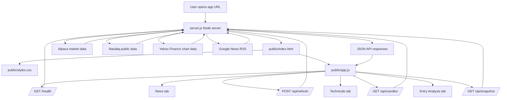

# Mag 7 Stock Desk

> **ML-driven Entry view:** The Entry tab is now powered by an offline,
> leakage-aware machine-learning pipeline in [`ml/`](ml/README.md) that
> predicts 20-trading-day performance relative to SPY. The previous rule-based
> Setup Quality score has been retired. The model's walk-forward performance is
> only modestly better than chance, so treat it as an early research model that
> abstains honestly, not a proven trading signal.

Mag 7 Stock Desk is a local web dashboard for monitoring the Magnificent 7 stocks:

- Apple (`AAPL`)
- Microsoft (`MSFT`)
- Alphabet (`GOOGL`)
- Amazon (`AMZN`)
- NVIDIA (`NVDA`)
- Meta (`META`)
- Tesla (`TSLA`)

The app combines market data, technical indicators, candlestick pattern checks, analyst target context, and scoped news headlines. It is designed as a decision-support dashboard, not as automated financial advice.

## What's New

- **ML-based Entry Analysis.** The Entry tab now shows a trained machine-learning recommendation — Buy, Hold, or Sell with calibrated probabilities — for each stock's expected 20-trading-day performance relative to SPY. Predictions are generated offline by the pipeline in `ml/` and served to the app through a versioned JSON file; the model abstains with Hold unless a calibrated Buy or Sell probability clears the configured threshold. The former rule-based Setup Quality score has been removed. See [Interpreting the ML Suggestion](#interpreting-the-ml-suggestion).
- **Complete market statistics, including bid/ask.** The Technicals panel now reliably fills bid, ask, average volume, market cap, 52-week range, P/E, EPS, and dividend yield through a multi-source enrichment layer (Nasdaq, Yahoo, and Alpaca's latest-quote endpoint). Values are cached per symbol so the panel never regresses to `--`. Outside market hours, bid/ask show a note that they will appear during the next trading day if no quote source is available.
- **Simplified UX.** The layout has been reorganized around three tabs — Entry Analysis, Technicals, and News — with redundant market-wide panels removed.
- **Deployment support.** The repo now includes `package.json`, `render.yaml`, and a `Dockerfile` for running the app on Render, in Docker, or on any Node host. See [Deployment](#deployment).

## Main Views

### Entry Analysis

Entry Analysis is the first tab and shows the trained model's outlook for the selected stock.

It includes:

- A synced stock selector for the Mag 7 symbols.
- A Buy, Hold, or Sell suggestion for the next 20 trading days relative to SPY.
- A confidence level (High, Moderate, or Low) derived from the calibrated probabilities.
- The calibrated Buy, Hold, and Sell probabilities.
- The prediction date (`As of`), benchmark, and data-quality status.
- The model name and version.
- A staleness warning when the prediction file has not been regenerated recently.

Predictions are generated offline by the `ml/` pipeline and written to `data/ml_predictions.json`, which the Node server serves with each snapshot. The browser never sees the model or any credentials. A suggestion is only displayed as Buy or Sell when its calibrated probability reaches the threshold in `ml/config.json` (currently 60%); otherwise the model abstains with Hold. See [Interpreting the ML Suggestion](#interpreting-the-ml-suggestion).

### Technicals

Technicals contains the charting and indicator workspace for the selected stock.

It includes:

- Live price strip.
- Candlestick chart.
- Historical price chart.
- Candle interval controls: `5m`, `15m`, `30m`, and `4h`.
- Candle period controls: `1D`, `1W`, `3M`, `6M`, `1Y`, and `All`.
- Chart zoom and pan controls.
- Company profile fields (CEO, founded, employees, headquarters).
- Market statistics: bid, ask, volume, average volume, open, today's high/low, market cap, 52-week high/low, P/E ratio, EPS, dividend yield, and previous close.
  - Bid and ask come from live quote data. Outside market hours they may be unavailable from some providers; when no quote is available, the panel shows a note that the value will appear during the next trading day.
- Technical indicators:
  - SMA 20
  - SMA 50
  - RSI 14
  - Volume ratio
  - Bullish/neutral/bearish signal
- Candlestick pattern analysis across multiple periods and intervals.

### News

News is scoped to the selected stock so it is clear which symbol is being reviewed.

It includes:

- Synced stock selector.
- Scope heading such as `Looking for GOOGL news and analyst reviews`.
- Analyst review cards.
- Analyst consensus target, low target, and high target where available.
- Firm/source review notes from analyst-related headlines.
- Google News headline feed for the selected stock.

## How The App Fits Together

The app has one Node backend and one static browser frontend.

High-level flow:

```text
server.js
  serves public/index.html, public/styles.css, public/app.js
  exposes /api/snapshot, /api/candles, /api/refresh, /health

browser
  loads index.html
  loads styles.css
  loads app.js
  app.js calls backend APIs
  app.js renders Entry Analysis, Technicals, and News
```

### Architecture Diagram



### File Responsibilities

| File | Role |
| --- | --- |
| `server.js` | Backend data engine and HTTP server. Fetches market data, candles, news, and analyst context. Serves the frontend and exposes API routes. |
| `public/index.html` | Page skeleton. Defines the tab structure, panels, placeholders, chart canvases, and script/style references. |
| `public/app.js` | Frontend logic. Fetches API data, manages state, switches tabs, syncs stock selectors, calculates Entry Analysis, renders news/reviews, and draws charts. |
| `public/styles.css` | Visual layer. Controls layout, cards, tabs, responsive behavior, Entry Analysis styling, chart panels, News cards, and the scoring rules drawer. |
| `ml/` | Offline machine-learning pipeline: data fetching, feature engineering, training, walk-forward validation, and prediction generation. Never loaded by the running app. |
| `data/ml_predictions.json` | Versioned prediction file produced by `ml/predict.py` and read by `server.js`. Must be committed so deployments that build from git can serve it. |
| `README.md` | Project documentation. Explains usage, setup, deployment, APIs, the ML suggestion, and troubleshooting. It is not loaded by the running app. |
| `package.json` | Node project metadata and scripts. `npm start` depends on this file because it runs `node server.js`. |
| `render.yaml` | Render deployment configuration. Defines build/start commands, health check path, and default environment variables. |
| `Dockerfile` | Optional container deployment definition. Builds a Node image and starts the app with `npm start`. |
| `.dockerignore` | Optional Docker helper. Excludes unnecessary files from Docker image builds. |

### Runtime Request Flow

1. A user opens the app URL.
2. `server.js` serves `public/index.html`.
3. The browser loads `public/styles.css` and `public/app.js`.
4. `public/app.js` calls:

```text
GET /api/snapshot
```

5. `server.js` returns stock rows, news items, analyst reviews, timestamps, and error metadata.
6. `public/app.js` renders:

- Entry Analysis
- Technicals
- News

7. When the user changes candle period or interval, `public/app.js` calls:

```text
GET /api/candles?symbol=GOOGL&period=week&interval=4h
```

8. `server.js` returns detailed candle data.
9. `public/app.js` redraws the candlestick chart and updates pattern analysis.

### Deployment File Requirements

For a normal Node deployment, these files are required:

```text
server.js
package.json
public/index.html
public/app.js
public/styles.css
```

For Render deployment, include:

```text
render.yaml
```

For Docker deployment, include:

```text
Dockerfile
.dockerignore
```

If `package.json` is missing, most hosts will not know how to run `npm start`. If `public/app.js` or `public/styles.css` is missing or stale, the server may start but the browser UI can look broken or behave like an older version.

## Data Sources

The app uses several data sources with fallback behavior:

- Alpaca market data, when `ALPACA_API_KEY` and `ALPACA_API_SECRET` are configured.
- Nasdaq public endpoints for market snapshot, historical data, and analyst target information.
- Yahoo Finance chart endpoints as a fallback for quote/history/candle data.
- Google News RSS for headlines and analyst-related news.

For market snapshots, the app prefers Alpaca when credentials are available. If Alpaca is not configured or temporarily unavailable, it tries Nasdaq and Yahoo public endpoints. If public providers rate-limit the request, the app preserves the last good snapshot where possible and can use cached candle data as a fallback instead of showing blank rows.

### Fundamentals Enrichment

Alpaca and Yahoo snapshot rows do not carry fundamentals (bid/ask, average volume, market cap, 52-week range, P/E, EPS, dividend yield), and a rate-limited cycle can blank them entirely. A separate enrichment layer fills these gaps on every snapshot:

1. Nasdaq summary/info endpoints are tried first. Because Nasdaq stopped exposing EPS and P/E on its quote summary, trailing-twelve-month EPS is derived from the last four reported quarters, and P/E is computed from that EPS and the current price.
2. Yahoo Finance chart data fills anything still missing, including the 52-week range derived from a year of daily history.
3. Alpaca's latest-quote endpoint is tried as a third source for bid/ask. It returns the last known quote of the session even after hours, whereas Nasdaq only has bid/ask while the market is open.

Fetched values are cached per symbol and refreshed every 10 minutes by default (`FUNDAMENTALS_REFRESH_MS`). The last good value is kept between refreshes, so the market statistics panel never regresses to `--` after it has shown real data once.

## Running Locally

Install dependencies:

```bash
npm install
```

Start the app:

```bash
npm start
```

Open:

```text
http://localhost:3000
```

If port `3000` is already in use, run on another port:

```bash
PORT=3001 npm start
```

## Optional Alpaca Configuration

Alpaca credentials are recommended because public finance endpoints can rate-limit.

Set these environment variables before starting the app:

```bash
export ALPACA_API_KEY="your_key"
export ALPACA_API_SECRET="your_secret"
npm start
```

Or run inline:

```bash
ALPACA_API_KEY="your_key" ALPACA_API_SECRET="your_secret" npm start
```

When configured, Alpaca is used first for market snapshots and detailed candle data. The `4h` candle interval maps to Alpaca `4Hour` bars.

## Refresh Behavior

Default refresh intervals:

- Market snapshot: every 60 seconds.
- News and analyst review data: every 10 minutes.
- Fundamentals enrichment (bid/ask, market cap, 52-week range, P/E, EPS): every 10 minutes.

Override intervals:

```bash
REFRESH_MS=15000 NEWS_REFRESH_MS=600000 npm start
```

Other environment variables:

```bash
PORT=3000
FETCH_TIMEOUT_MS=12000
FUNDAMENTALS_REFRESH_MS=600000
ML_STALE_AFTER_MS=432000000
ALPACA_API_KEY=...
ALPACA_API_SECRET=...
```

`ML_STALE_AFTER_MS` controls how old `data/ml_predictions.json` may be (by its `generatedAt` timestamp) before the Entry panel flags the outlook as stale. The default is 5 days.

## API Endpoints

### Health Check

```text
GET /health
```

Returns basic server status.

### Snapshot

```text
GET /api/snapshot
```

Returns:

- Loading state.
- Refresh timestamps.
- Errors, if any.
- Stock rows.
- News items.
- Analyst review items.
- Refresh interval metadata.

### Manual Refresh

```text
POST /api/refresh
```

Forces a fresh market snapshot and news refresh.

### Detailed Candles

```text
GET /api/candles?symbol=GOOGL&period=week&interval=4h
```

Supported periods:

- `day`
- `week`
- `threeMonth`
- `sixMonth`
- `oneYear`
- `all`

Supported intervals:

- `5m`
- `15m`
- `30m`
- `4h`

When Alpaca is configured, detailed candles use Alpaca first. Without Alpaca, Yahoo is used where possible. For `4h` Yahoo fallback, the app fetches `1h` candles and aggregates them into 4-hour candles.

## Interpreting the ML Suggestion

The Entry tab's suggestion comes from a trained classifier, not a guarantee, and should not be treated as a buy or sell instruction.

### What the model predicts

The model predicts each stock's performance **relative to SPY over the next 20 trading days**. Labels are defined on excess return:

- `BUY`: expected to outperform SPY by more than 2%.
- `SELL`: expected to underperform SPY by more than 2%.
- `HOLD`: expected result falls between those thresholds.

The displayed probabilities are calibrated on a held-out historical window, so "62% Buy" is intended to mean roughly 62 of 100 similar situations outperformed. A suggestion is only shown as Buy or Sell when its calibrated probability reaches the `probability_threshold` in `ml/config.json` (currently `0.60`); otherwise the model **abstains with Hold**. Confidence bands derive from the same threshold: `Moderate` at the threshold, `High` at the threshold plus 15 points.

### How it was trained

- ~10 years of split/dividend-adjusted daily OHLCV data for 100 liquid US stocks, including the Mag 7 and SPY.
- Strictly trailing, point-in-time features (returns, moving-average structure, RSI, volatility, ATR, drawdowns, volume, gaps, benchmark context, calendar fields); tests verify that adding future rows cannot change historical feature values.
- Walk-forward validation over five expanding date folds with a 20-session embargo between training and validation, instead of random splits.
- A multinomial logistic regression and a gradient-boosted model were compared; logistic regression won on log loss and was selected.

Details, commands, and the full input contract live in [`ml/README.md`](ml/README.md).

### Honest limitations

Current walk-forward accuracy is only modestly better than chance (~38% across three classes), which is why all seven stocks commonly show `HOLD` with `Low` confidence. That is the abstention mechanism working as intended — the app does not manufacture high-confidence recommendations from a weak signal. Treat this as an early research model whose value is still being established.

### Keeping predictions fresh

Predictions are a static file (`data/ml_predictions.json`) generated offline. In production this is automated with a GitHub Actions workflow (`.github/workflows/refresh-predictions.yml`) that runs `ml.refresh_predictions --publish` after each weekday's market close: it fetches a small trailing window of new bars, scores it with the already-trained model, and commits+pushes the updated file — which then triggers Render's normal auto-deploy of the web service. GitHub Actions was chosen over a Render Cron Job because Render's cron requires a paid plan, while Actions' free tier easily covers one small daily job. See [`ml/README.md`](ml/README.md#daily-automated-refresh) for the required repository secrets and why git is the hand-off between the job and the running app rather than a shared disk.

To regenerate predictions by hand (locally, or against a full historical dataset) instead:

```bash
.venv/bin/python -m ml.predict \
  --data data/daily_adjusted.csv \
  --symbols AAPL MSFT GOOGL AMZN NVDA META TSLA \
  --output data/ml_predictions.json
```

Either way, if the file's `generatedAt` is older than `ML_STALE_AFTER_MS` (default 5 days), the server marks the outlook stale and the Entry panel shows a warning instead of presenting old probabilities as current.

## Troubleshooting

### I see `429 Too Many Requests`

Public providers can rate-limit requests. Configure Alpaca credentials for more reliable market data. The app also caches recent data and preserves prior snapshots where possible.

### I see blank prices or `--`

This usually means no provider returned usable market snapshot data yet. Try:

1. Refreshing after a minute.
2. Confirming Alpaca environment variables are set.
3. Restarting the server after setting environment variables.
4. Checking `/health`.

### The 4-hour chart is empty locally

If Alpaca is not configured, the app uses public fallback providers. These can rate-limit. In an Alpaca-configured environment, the 4-hour chart should use Alpaca `4Hour` bars.

### Bid and Ask show a note instead of a value

No provider returned a live quote. Outside market hours the note reads "Appears during the next trading day" (Nasdaq only publishes bid/ask while the market is open); during the session it reads "Waiting for a live quote," which means providers are temporarily failing or rate-limited. With Alpaca credentials configured, the app can usually show the last known quote of the session even after hours.

### The Entry tab says "Model unavailable"

The server could not load `data/ml_predictions.json`. Run the prediction step from [`ml/README.md`](ml/README.md) to generate it, and make sure the file is committed if the app was deployed from git. If the panel instead shows a stale-predictions warning, the file exists but its `generatedAt` is older than `ML_STALE_AFTER_MS` — rerun `ml.predict` with fresh daily data.

### News loads but technical data does not

News comes from Google News RSS and is independent from market-data providers. If news works but prices do not, the issue is likely with Alpaca/Nasdaq/Yahoo data access.

## Deployment

### Render

1. Push this project to GitHub.
2. Create a new Render Web Service.
3. Connect the GitHub repository.
4. Use the included `render.yaml` or configure:

```text
Runtime: Node
Build Command: npm install
Start Command: npm start
Health Check Path: /health
```

5. Add environment variables in Render:

```text
ALPACA_API_KEY
ALPACA_API_SECRET
```

6. Deploy and open the Render URL.

Render builds from the git repository, so `data/ml_predictions.json` must be committed for the Entry tab to work in production — it is tracked on purpose (see `.gitignore`). After regenerating predictions, commit and push the updated file; otherwise the deployed app serves the previous predictions until they age past `ML_STALE_AFTER_MS` and are flagged stale.

### Docker

Build:

```bash
docker build -t mag7-stock-desk .
```

Run:

```bash
docker run -p 3000:3000 \
  -e ALPACA_API_KEY="your_key" \
  -e ALPACA_API_SECRET="your_secret" \
  mag7-stock-desk
```

Open:

```text
http://localhost:3000
```

## Production Notes

- Keep the Node server running; the frontend depends on backend API routes.
- Static hosting alone is not enough because `/api/snapshot`, `/api/candles`, and `/api/refresh` require the Node server.
- Public finance endpoints may change, rate-limit, or block traffic.
- Alpaca credentials are strongly recommended for consistent candle and snapshot behavior.
- This app is for research and monitoring. It does not provide personalized financial advice.
